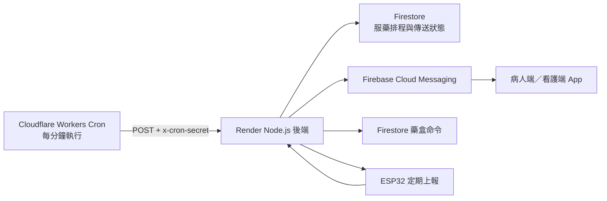

# Cloudflare 免費排程推播設計

日期：2026-06-12
狀態：已確認架構，等待規格審閱

## 目標

讓服藥時間到達時，即使手機沒有開啟 App、Render 曾經休眠，系統仍能：

1. 透過 FCM 發送手機背景通知與震動。
2. 對病人的 ESP32 藥盒排入蜂鳴器命令。
3. 在暫時失敗時自動重試，同一個服藥時段不重複通知。

此方案保留 Firebase Cloud Messaging 作為手機推播服務，只把不可靠的 Render 程序內計時器改由 Cloudflare Workers Cron 定時觸發。

## 選定架構

### 元件責任

- **Cloudflare Worker**：每分鐘呼叫一次 Render，不保存 Firebase 金鑰，也不直接查詢病人資料。
- **Render 後端**：驗證排程密鑰、查詢到期服藥資料、發送 FCM、排入藥盒命令並更新傳送狀態。
- **Firestore**：保存服藥排程、排程處理租約、手機推播結果與藥盒命令結果。
- **FCM**：將通知傳到已登入且屬於病人或看護帳號的裝置。
- **ESP32**：持續輪詢或上報取得雲端命令；蜂鳴器總開關關閉時，不執行服藥蜂鳴。

## Cloudflare Worker

新增獨立 Worker，Cron 表達式為 `* * * * *`。每次執行：

1. 對 Render 的 `POST /internal/check-medicine-reminders` 發送請求。
2. 使用 `x-cron-secret` 傳送 Cloudflare Secret 中的 `CRON_SECRET`。
3. 單次請求設定合理逾時；網路錯誤或 `5xx` 時，在同次 Cron 執行中重試一次。
4. 記錄 HTTP 狀態與後端回傳摘要，不記錄病人姓名、藥名、FCM Token 或密鑰。

Worker 使用以下設定：

- `RENDER_BASE_URL`：Render 後端網址。
- `CRON_SECRET`：至少 32 bytes 的隨機秘密，只存在 Cloudflare Secret 與 Render 環境變數。

每分鐘執行約為每日 1,440 次，低於 Cloudflare Workers Free 目前每日 100,000 次請求限制。免費額度與條款仍可能變更，部署前需再確認。

## Render 排程端點

新增 `POST /internal/check-medicine-reminders`，規則如下：

- 只接受正確的 `x-cron-secret`。
- 缺少或錯誤密鑰回傳 `401`，且不執行任何查詢。
- 正常完成回傳 `200` 與計數摘要。
- 暫時性系統錯誤回傳 `500`，讓 Worker 判斷需要重試。
- 原本公開的 `GET /check-medicine-reminders` 必須移除，或改用同一密鑰保護，避免外部任意觸發。

現有 `setInterval` 與 ESP32 `/device/report` 觸發先保留為備援，但所有觸發來源都必須共用同一套防重複處理流程。Render 程序內計時器不再被視為主要排程。

## 防重複與重試

每一筆服藥排程以「藥物文件 ID + 日期 + 時間」形成固定的 `reminderKey`，例如 `medicineId_2026-06-12_14-00`。後端在獨立的 `reminderDeliveries` 集合中，以此 key 建立每日傳送紀錄，避免前一天的完成狀態影響下一天。後端使用 Firestore Transaction 原子領取工作，避免 Cloudflare、Render 計時器與 ESP32 上報同時觸發重複通知。

`reminderDeliveries/{reminderKey}` 必須保存：

- `reminderState`：`pending`、`processing`、`completed`、`expired`
- `reminderKey`
- `reminderLeaseUntil`
- `reminderAttemptCount`
- `phoneNotificationSent`
- `phoneNotificationSentAt`
- `medicineBoxCommandQueued`
- `medicineBoxCommandQueuedAt`
- `reminderLastError`
- `reminderLastAttemptAt`

處理規則：

1. `pending` 或處理租約已過期的資料才可被領取。
2. Transaction 將資料改為 `processing`，設定短期租約並增加嘗試次數。
3. 手機推播與藥盒蜂鳴器分別執行、分別記錄結果。
4. 只有手機推播至少一個有效 Token 成功，且需要蜂鳴時藥盒命令成功排入，才標記 `completed`。
5. 已成功的通道在下一次重試時不再重送，只重試失敗的通道。
6. FCM 無有效 Token 時保留可重試狀態與錯誤原因，不可寫成已完成。
7. 病人已關閉蜂鳴器時，記錄 `medicineBoxCommandQueued=false` 與停用原因，將藥盒通道視為不需傳送，不因未排入命令而持續重試。
8. 超過服藥時間 10 分鐘仍未成功時標記 `expired`，停止蜂鳴與一般提醒；逾時後的照護警示不在本次範圍。

這套狀態會取代目前只用 `reminderSent=true` 的完成判斷，避免 FCM 或藥盒命令失敗後永久失去提醒。

## FCM 與藥盒行為

- FCM 延用目前的 `notification + data` payload 與 `medicine_fcm_channel_v5`。
- 通知只傳給該病人與其有效看護關係所屬的 FCM Token。
- 無效或已撤銷的 FCM Token 應從帳號資料中移除，避免每次排程持續失敗。
- 藥盒命令沿用現有雲端命令機制；本次只保證成功排入，不代表 ESP32 已實際播放。
- ESP32 命令送達確認與命令佇列化是後續可靠性工作，不在這次 Cloudflare 排程改造範圍。

## 錯誤處理與觀測

後端每次檢查回傳下列計數，不包含個資：

- `checkedCount`
- `claimedCount`
- `completedCount`
- `retryCount`
- `expiredCount`
- `failedCount`

日誌需包含 `reminderKey`、嘗試次數、失敗通道與錯誤類型，但不得輸出 FCM Token、Firebase 憑證或 `CRON_SECRET`。

Cloudflare 呼叫失敗時不自行修改 Firestore。下一分鐘 Cron 會再次觸發；若後端在處理中斷，租約到期後可重新領取。

## 測試

### 單元測試

- 正確與錯誤 `CRON_SECRET` 的驗證。
- 同一 `reminderKey` 被多個觸發來源呼叫時只領取一次。
- FCM 成功、藥盒成功時才完成。
- 蜂鳴器已關閉時，FCM 成功即可完成且不排入蜂鳴命令。
- FCM 失敗時只重試 FCM。
- 藥盒排入失敗時只重試藥盒。
- 處理程序中斷後，租約到期可以重新領取。
- 超過 10 分鐘後轉為 `expired`。

### 整合驗證

1. 建立兩分鐘後到期的測試藥物。
2. 將 App 完全關閉並讓 Render 進入可休眠狀態。
3. 確認 Cloudflare Cron 能喚醒 Render。
4. 確認手機收到一次通知與震動。
5. 確認藥盒取得一次蜂鳴器命令。
6. 重複呼叫排程端點，確認不會再次通知。
7. 暫時製造 FCM 或藥盒命令失敗，確認下一分鐘只重試失敗通道。

實體手機的背景通知與震動必須用真機驗證；Android 模擬器只能作為輔助，不能取代最終驗收。

## 部署順序與回復方式

1. 先部署後端私有端點、防重複狀態與測試。
2. 在 Render 設定 `CRON_SECRET`。
3. 部署 Cloudflare Worker，設定相同 Secret 與 Render 網址。
4. 手動呼叫 Worker 並完成整合驗證。
5. 啟用每分鐘 Cron。
6. 觀察至少一個完整服藥時段後，再評估是否移除 Render 的 `setInterval`。

若 Cloudflare 排程異常，可停用 Cron；Render 內部計時器與 ESP32 上報觸發仍暫時保留，不需要回退資料格式。

## 非本次範圍

- ESP32 取藥事件由後端持久化，不再依賴 App 輪詢。
- 將單一 `deviceCommand` 改為可靠命令佇列與裝置確認。
- 服藥逾時後通知看護的升級警示流程。
- 付費、具 SLA 的醫療級排程與監控服務。

## 服務限制

此方案適合目前的免費原型與測試。Render 官方說明免費服務可能休眠、重啟，且不建議用於正式生產；Cloudflare 免費額度也沒有醫療級 SLA。若系統進入實際長照或醫療使用，需改用不休眠的付費服務、告警監控與正式可靠性驗證。

參考：

- [Cloudflare Cron Triggers](https://developers.cloudflare.com/workers/configuration/cron-triggers/)
- [Cloudflare Workers Limits](https://developers.cloudflare.com/workers/platform/limits/)
- [Render Free Instances](https://render.com/docs/free)
- [Firebase Scheduled Functions](https://firebase.google.com/docs/functions/schedule-functions)
