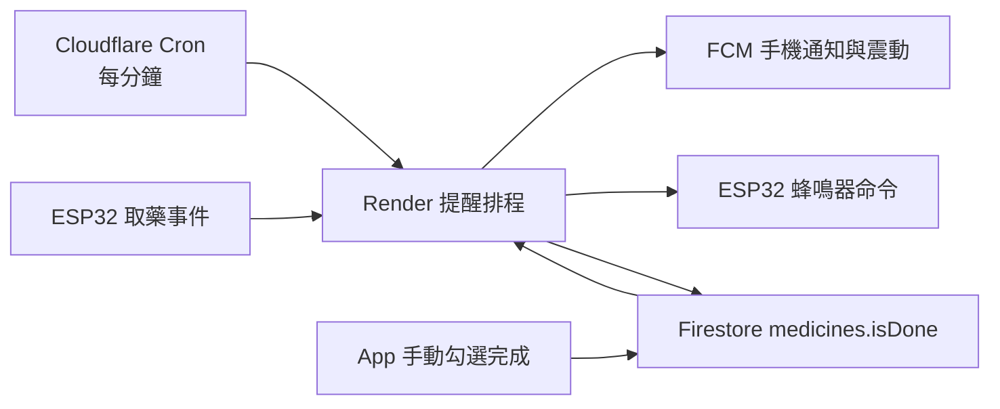

# 未服藥每五分鐘重提醒設計

日期：2026-06-12

## 目標

服藥時間到達時立即發送一次手機通知、震動與藥盒蜂鳴。若服藥尚未完成，從首次提醒五分鐘後開始，每五分鐘再次發送手機通知、震動與藥盒蜂鳴，直到該次服藥完成。

霍爾感測器與 App 開關蓋顯示目前已確認正常，本次不修改相關韌體或 App 顯示邏輯。

## 選定架構

沿用目前已部署的 Cloudflare Worker 每分鐘呼叫 Render。所有正式提醒由 Render 根據 Firestore 狀態決定，App 不再負責建立「未服藥」系統通知。

## 提醒時序

每筆服藥資料以原本的 `reminderKey` 建立每日傳送狀態。

1. 到達服藥時間時，立即發送 `medicine_reminder`。
2. 下一次重提醒時間固定為原服藥時間加五分鐘，不因 FCM 或藥盒通道暫時失敗而延後。
3. 若 `medicines.isDone` 仍不是 `true`，到達下一次時間後發送 `medicine_overdue_reminder`。
4. 後續節點固定為原服藥時間加十、十五、二十分鐘，依此類推。
5. `isDone=true` 後不再發送手機通知或蜂鳴命令。
6. 若 FCM 或藥盒通道暫時失敗，下一分鐘只重試失敗通道；成功通道不在同一輪重複發送。

重提醒不沿用目前首次提醒的十分鐘過期限制。尚未完成的服藥會跨午夜持續每五分鐘提醒，直到完成為止。

## 傳送狀態

`reminderDeliveries/{reminderKey}` 增加：

- `initialReminderCompletedAt`
- `repeatCount`
- `nextRepeatAt`
- `scheduledMedicineAt`
- `currentCycleKey`
- `currentCyclePhoneSent`
- `currentCycleMedicineBoxQueued`
- `lastRepeatAt`
- `stoppedAt`
- `stopReason`

每一輪以 `currentCycleKey` 區分，例如 `initial`、`repeat-1`、`repeat-2`。重提醒編號由目前時間相對 `scheduledMedicineAt` 的五分鐘區間計算，因此重啟或短暫停機後不會改變時序。同一輪的手機與藥盒通道分開記錄，避免 Cloudflare、Render 內部計時器與 ESP32 上報同時觸發造成重複。

## 完成與停止

正式停止條件是 `medicines.isDone=true`。

完成來源：

- 病人或看護在 App 手動勾選完成。
- ESP32 回報 `taken=true` 時，由 Render 後端直接將對應服藥資料寫為完成。

ESP32 每秒上報且 `taken` 保留三十秒，因此後端可在 App 關閉時接收事件。後端必須先保存取藥事件，再更新服藥完成狀態，不能再依賴 App 輪詢。

ESP32 取藥事件與服藥資料的配對沿用現有時段邏輯：依病人、當日、尚未完成且已到時間的服藥資料，選擇最接近目前時間且未完成的一筆。若沒有可安全配對的資料，只保存裝置事件，不任意完成其他藥物。

## 背景震動

建立新的 Android 通知頻道 `medicine_fcm_channel_v6`，避免已存在的 v5 頻道設定被 Android 快取。

後端 FCM Android payload 明確設定：

- `channelId: medicine_fcm_channel_v6`
- `priority: max`
- `sound: default`
- `vibrateTimingsMillis: [0, 800, 300, 800, 300, 1200]`
- `visibility: public`

App 啟動時建立相同 ID、最高重要性、聲音與震動時序的頻道。背景收到含 `notification` 的 FCM 時由 Android 系統顯示，不額外建立第二則本機通知；App 前景收到時才使用本機通知與震動套件。

手機仍必須允許該通知頻道震動，且系統不可處於完全靜音、勿擾或停用震動的模式。Android 模擬器沒有實體震動馬達，最終驗收必須使用真機。

## App 行為

移除 `PatientMedicineWarningCard` 在畫面開啟時呼叫 `AppNotificationService.medicineAlert()` 的副作用，避免一進 App 又跳一則未服藥通知。

App 仍保留：

- 未服藥警示卡。
- 通知頁中的未服藥紀錄。
- 手動勾選服藥完成。

App 的畫面計時器只更新顯示，不負責正式背景通知。

## 蜂鳴器

- 首次提醒與每次五分鐘重提醒都排入一次 `beep`。
- 手機設定的蜂鳴器總開關為關閉時，不排入蜂鳴命令，但手機通知仍繼續。
- 完成後停止排入新命令。
- 本次沿用現有單一 `deviceCommand`；命令佇列與 ESP32 執行確認仍屬後續可靠性工作。

## 錯誤處理

- FCM 零成功數不算成功，保留該輪待重試。
- 藥盒未註冊或暫時離線時保留藥盒通道待重試。
- FCM 無效 Token 依現有邏輯移除。
- 單輪部分成功時只補送失敗通道。
- 完成狀態優先於待發提醒；排程每次執行都先重新讀取 `isDone`。
- 重提醒狀態更新使用 Firestore Transaction 與租約，避免同分鐘重複。

## 測試

### 後端

- 首次提醒時建立原服藥時間加五分鐘的 `nextRepeatAt`。
- 五分鐘未到時不發送。
- 五分鐘到且未完成時發送手機與蜂鳴器。
- 跨午夜後仍持續處理尚未完成的 delivery。
- 同一輪重複觸發只發送一次。
- 手機成功、藥盒失敗時只重試藥盒。
- `isDone=true` 立即停止。
- 蜂鳴器關閉時手機成功即可完成該輪。
- ESP32 `taken=true` 可在 App 關閉時完成正確服藥資料。
- 無法安全配對時不誤完成。

### App

- 建立 v6 通知頻道。
- 前景 FCM 只顯示一次通知。
- 開啟未服藥畫面不再建立系統通知或額外震動。
- 手動完成後 Firestore 的 `isDone` 正確更新。

### 實機驗收

1. 建立兩分鐘後的測試服藥。
2. 完全關閉 App。
3. 確認時間到時手機通知、震動與藥盒蜂鳴。
4. 不取藥，確認五分鐘後再次通知、震動與蜂鳴。
5. 開蓋取藥並關蓋，確認 App 關閉時後端仍寫入完成。
6. 再等待五分鐘，確認不再提醒。

## 非本次範圍

- 霍爾感測、開關蓋判定與顯示。
- 跌倒偵測。
- 藥盒命令佇列與裝置執行確認。
- 勿擾模式的系統級繞過。
